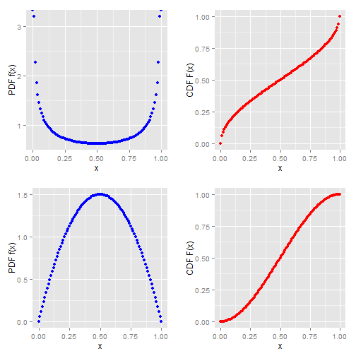

## Introduction (Slide 2)
Introducing a Shiny App to explore the various shapes of the Beta distribution!  
The Beta distribution is a family of continuous probability distributions whose shapes are controlled by two positive shape parameters, denoted by $latex\alpha$ & $latex\beta$.  The app allows the user to adjust these shape parameters dynamically to see the effect on plots of the PDF (probability density or distribution function) and CDF (cumulative distribution function) of the Beta.  
For more detailed information, see the [Beta Distribution article on Wikipedia](https://en.wikipedia.org/wiki/Beta_distribution).  
  

--- .class #id

## Shiny App (Slide 3)
The application uses the [Shiny web framework](http://shiny.rstudio.com/) to provide a set of sliders, action buttons, and dynamic plots.  As the user modifies the shape parameters using the sliders or by pressing action buttons for preset examples, the plots dynamically update to show the different generated PDF and CDF graphs.  Documentation for the app is embedded in the app itself.  
Particularly helpful information with examples of [dynamically updating sliders](http://shiny.rstudio.com/reference/shiny/latest/updateSliderInput.html) and [using action buttons](http://shiny.rstudio.com/articles/action-buttons.html) in Shiny can be found at the Shiny support web site.  

--- .class #id

## Example (Slide 4)
Typical Beta PDFs & CDFs for $latex\alpha$ & $latex\beta$ combinations of (.5,.5) and (2,2):  
 

--- .class #id

## Other Information (Slide 5)
The Shiny App for the Beta demonstration is hosted at  
[https://brmjr9.shinyapps.io/shiny_beta_dist_app](https://brmjr9.shinyapps.io/shiny_beta_dist_app)  
The code for the Shiny app and these Slidify pages is archived at   [https://github.com/brmjr9/DevelopingDataProducts-ClassProject](https://github.com/brmjr9/DevelopingDataProducts-ClassProject)   
_Note: Both this Slidify presentation and the Shiny app discussed are academic exercises for a Coursera class assignment, and should be used only for that purpose._

